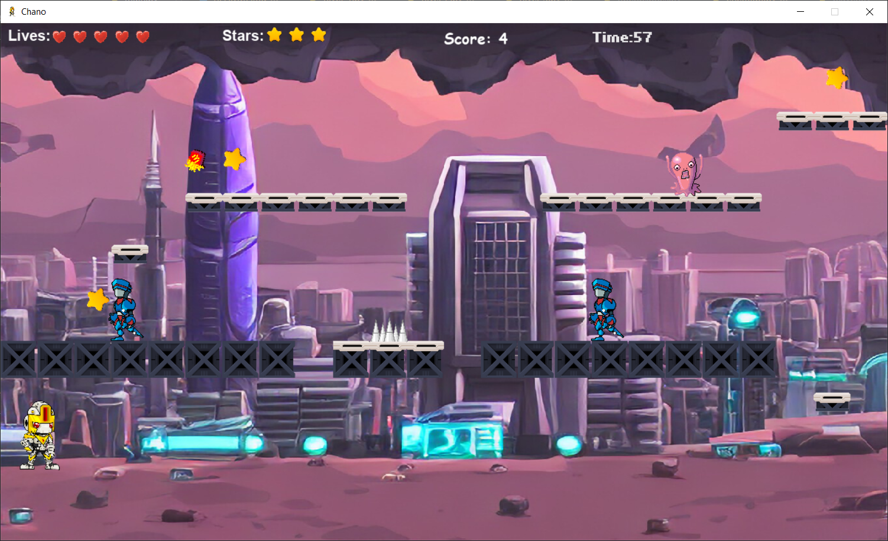
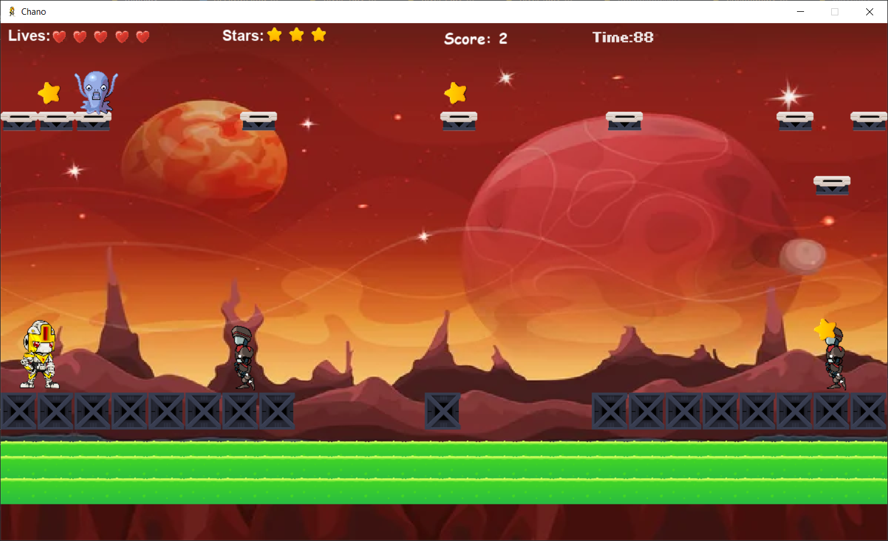
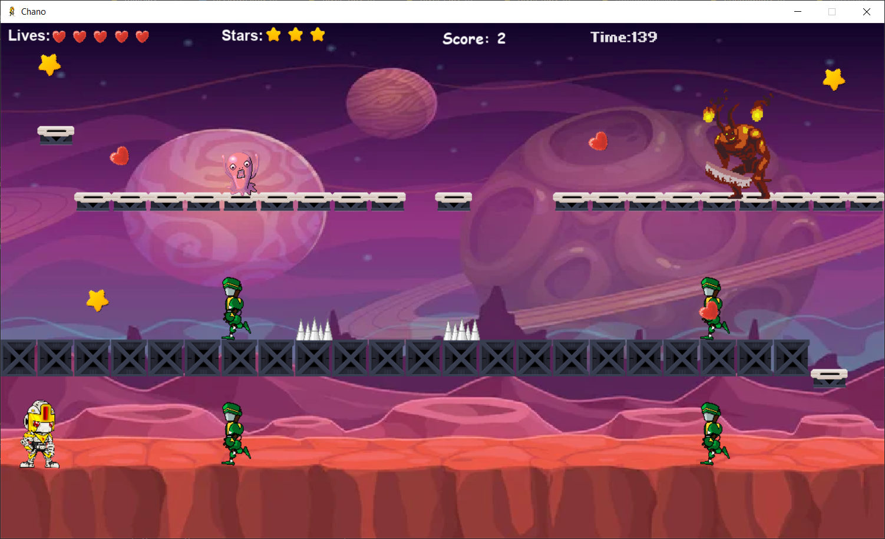

## Nombre del juego

Chano : juego de un robot hecho en 2d

### `Capturas de pantalla de los niveles`

**Nivel 1**

**Nivel 2**

**Nivel 3**

### `Instalacion`

Descarga el repositorio y ejecuta el archivo Main.py que se encuentra entre los archivos del juego

### `Como jugar`

-Movimientos del personaje: Flecha de izquierda (para moverse hacia la izquierda), flecha de derecha (para moverse hacia la derecha) y SPACE para saltar

-Ataque del personaje: Apretando la tecla 'Z' dispara

### `Contacto`

Mail de contacto: rarugfrancisco@gmail.com

Telefono: +54 9 11 5693-6839

Pagina-web: [https://francisco-rarug.github.io/Portafolio_web/]

**Nota: este es un juego hecho por Rarug Francisco con impulsos de la UTN (Universidad Tecnologica Nacional). Espero que les guste!!**